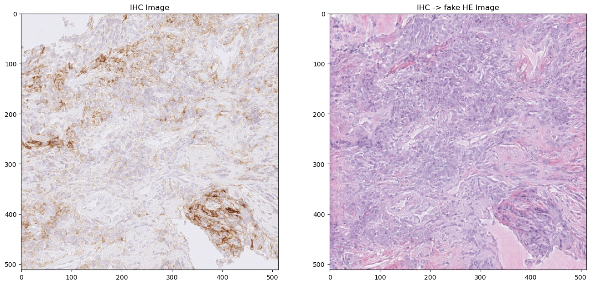
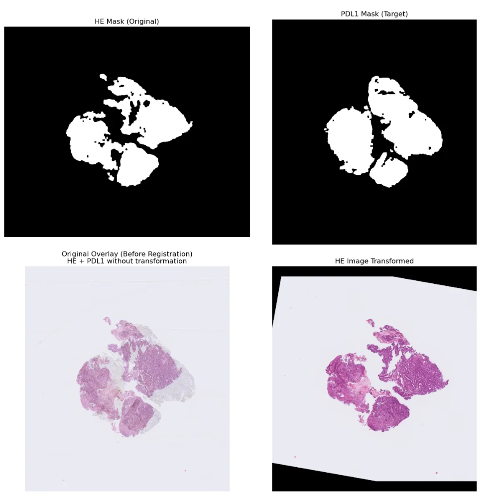
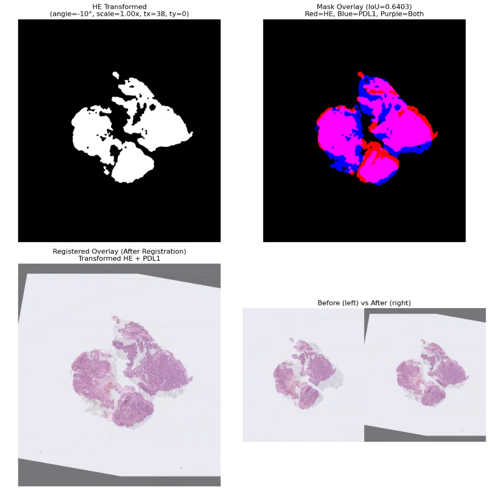

# 성모병원 데이터 HE&IHC 정합 데이터셋 구축

## **Purpose**

- 성모병원에서 구축한 PD-L1(22C3) 와 HnE 슬라이드 원본  77장의 Pair 이미지를 통하여 성모병원 데이터에 localize한 모델을 개발하는 것이 목적임.
- IHC→HnE의 가상 염색을 통하여 추후 CPS 알고리즘을 위한 Cell Annotation 가이드라인 (Tumor 영역 확인)을 위함임.
- 2차적인 목표로는 AI기반 IHC에서 Tumor, Non-tumor 영역 분할 모델이 어느정도 성능이 나오는지 연구가 별로 없어 확인할 수 없으나 HnE에서의 영역 분할은 꽤 많은 연구가 되어있는 상태이므로 Fake HnE에서 영역 분할 모델을 통해 real IHC에서 영역 분할을 진행함. ( 추후 본 내용으로 IHC 영역 분할 모델도 개발을 진행함.)

## Data Info

- 성모병원에서 구축한 PD-L1(22C3) 와 HnE 슬라이드 원본  77장의 Pair 이미지
- 슬라이드의 미세한 움직임이나 방향 및 관련 문제로 인해 Pair 데이터로 쓰기 위해서는 정합이 무조건적으로 필요함.

## **Current Problem**

- 기존 IHC4BC의 베이스 모델을 이용한  virtual stainning 은 구조적 유사도는 높으나 성모병원의 데이터에 적용하였을 때  성능이 좋지않음.
- Macenko normalizer 기법을 사용하여 IHC간 색 비율을 임의로 맞췄음에도 알수없는 이유로 시각적으로 의미가 없음.
- 또한 IHC4BC 데이터셋 같은 경우 유방암 한정으로 진행한 것이므로 구조적 유사도도 믿을 수 없음.




- IHC4BC 데이터와 성모병원의 IHC 데이터 색의 분포가 매우 다름 ( 세포의 뚜렷함)

-IHC4BC 데이터


-성모병원 데이터


## Algorithm

- 매칭방법은 마스크 기반 템플릿 매칭으로 진행하였으며 성능이 가장 좋다고 알려진 특징점 매칭방법은 다음과 같은 이유로 사용이 힘든 상태임.
- 특징점이란 근접 픽셀의 색을 통해 방향성이 일정수준 이상의 포인트를 찾는 것이나 **IHC에서는 색의 차이가 크지 않아** 특징점이 많이 나오지 않음.
- 특징점을 찾는다 해도 불 규칙적인 병리 이미지 특성 상 특징점 매칭이 쉽지 않음.


- 마스크 기반 템플릿 매칭의 경우 시간이 오래 걸린다는 단점과 매우 미세하게 조정은 힘들다는 단점은 있으나  패치화시 이미지 사이즈를 크게 잡는다면 미미한 정도임.
- 장점으로는 시각화하여 보기 편하며 직관적으로 매칭의 성과를 비교할 수 있음.






```json
# json 결과 예제
{
  "files": {
    "he_slide": "../../data/IHC_HE_Pair_Data_GA_hospital/PD-L1(HnE)/CODIPAI-STBX-SS-04320-S-EB-01.ndpi",
    "pdl1_slide": "../../data/IHC_HE_Pair_Data_GA_hospital/PD-L1(22C3)/CODIPAI-STBX-SS-04320-I-PD-22.ndpi",
    "prefix": "CODIPAI-STBX-SS-04320"
  },
  "dimensions": {
    "he_full": {
      "width": 30720,
      "height": 36864
    },
    "pdl1_full": {
      "width": 30720,
      "height": 32256
    },
    "he_thumbnail": {
      "width": 1023,
      "height": 1228
    },
    "pdl1_thumbnail": {
      "width": 1024,
      "height": 1075
    }
  },
  "transformation": {
    "thumbnail": {
      "angle_degrees": 18.0,
      "scale": 0.9500000000000002,
      "translation_x": -41.0,
      "translation_y": -2.0,
      "matrix": [
        [
          0.903503690480396,
          -0.29356614465620007,
          188.60747513818433
        ],
        [
          0.29356614465620007,
          0.903503690480396,
          -92.91034894660947
        ]
      ]
    },
    "fullres": {
      "angle_degrees": 18.0,
      "scale": 0.9500000000000002,
      "translation_x": -1231.2023460410558,
      "translation_y": -60.039087947882734,
      "matrix": [
        [
          0.903503690480396,
          -0.29356614465620007,
          5661.99214648314
        ],
        [
          0.29356614465620007,
          0.903503690480396,
          -2790.5950928017764
        ]
      ]
    }
  },
  "downsampling": {
    "factor_x": 30.029325513196483,
    "factor_y": 30.019543973941367
  },
  "quality": {
    "iou_score": 0.7227875285766098
  }
}
```

## 한계점

- 현재 IHC 염색의 색이 많이 연해서 마스크 추출(이진화)시 빠지는 영역이 조금 있음.
- 감안하더라도 전체영역에 대해서 어느정도 시각화로는 맞아보이나 performance로는 수치가 너무 낮은것으로 보아 HnE ↔ IHC 간의 조직 차이가 존재함.

### **Best match found:**

**Angle:** 20°
**Scale:** 0.90x
**Translation:** (-51, 0) pixels
**IoU Score:** 0.6430

### **Top 10 results:**

1. Angle= 20°, Scale=0.90x, Trans=(-51, 0), Score=0.6430
2. Angle= 20°, Scale=1.00x, Trans=(-51, 0), Score=0.6203
3. Angle= 20°, Scale=0.90x, Trans=( 0, 0), Score=0.5765
4. Angle= 20°, Scale=1.00x, Trans=( 0, 0), Score=0.5751
5. Angle= 30°, Scale=1.00x, Trans=(-51, 0), Score=0.5337
6. Angle= 30°, Scale=0.90x, Trans=(-51, 0), Score=0.5235
7. Angle= 10°, Scale=0.90x, Trans=( 0, 0), Score=0.5229
8. Angle= 30°, Scale=0.90x, Trans=( 0, 0), Score=0.5184
9. Angle= 10°, Scale=0.90x, Trans=(-51, 0), Score=0.5137
10. Angle= 30°, Scale=1.00x, Trans=(-51, 51), Score=0.5086

## patch an image

- 썸네일 변환 예시


- 패치 및 좌표 역변환 예시


- 역변환 패치화 진행 예시

